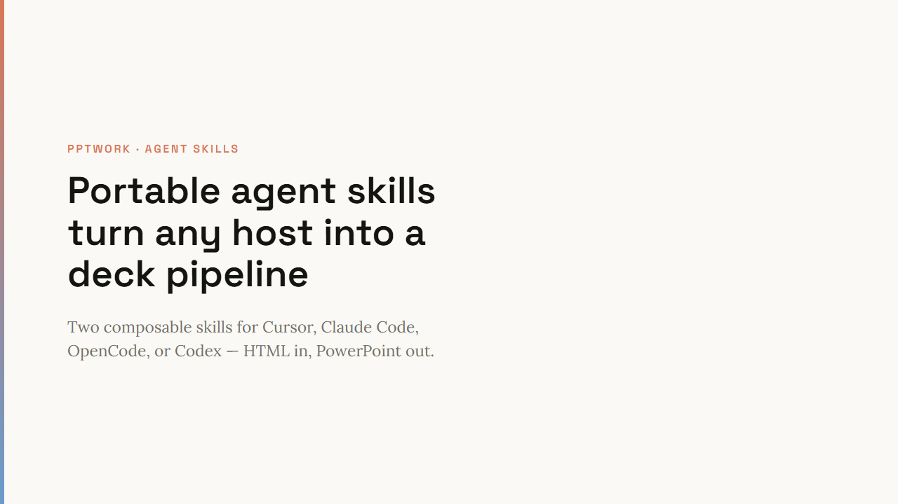
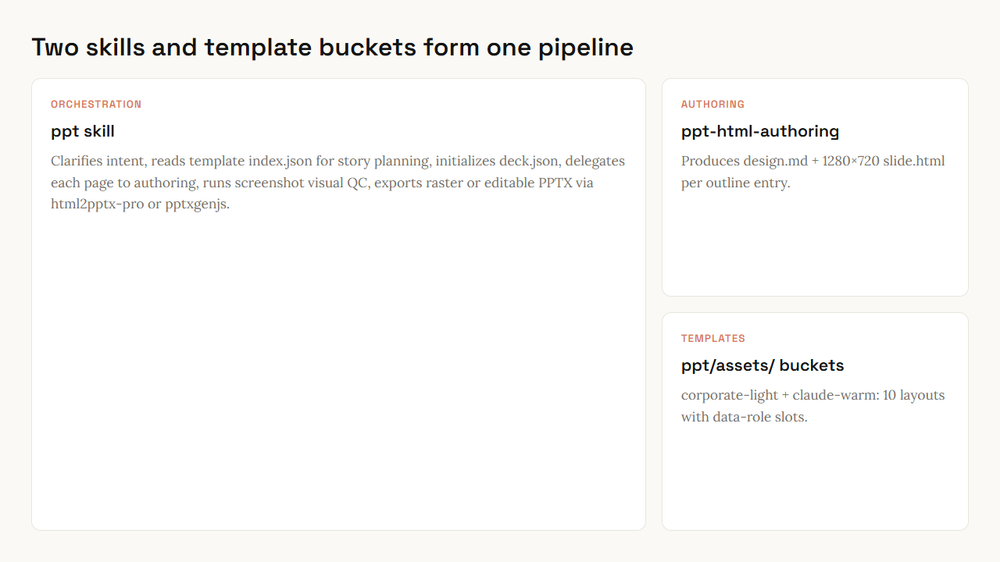
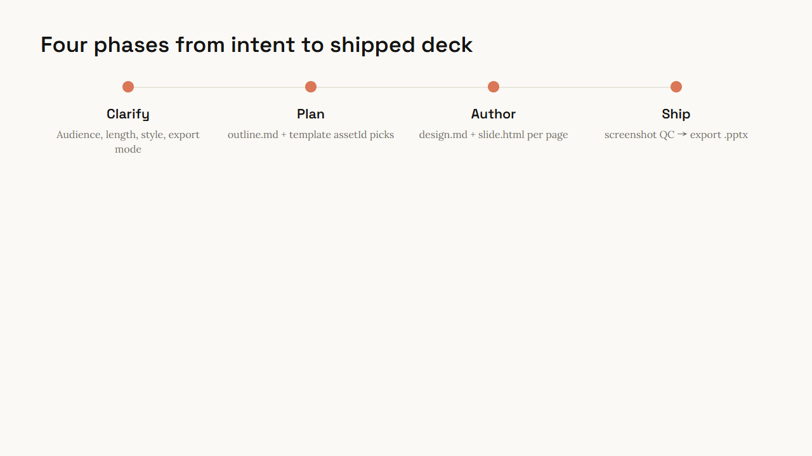
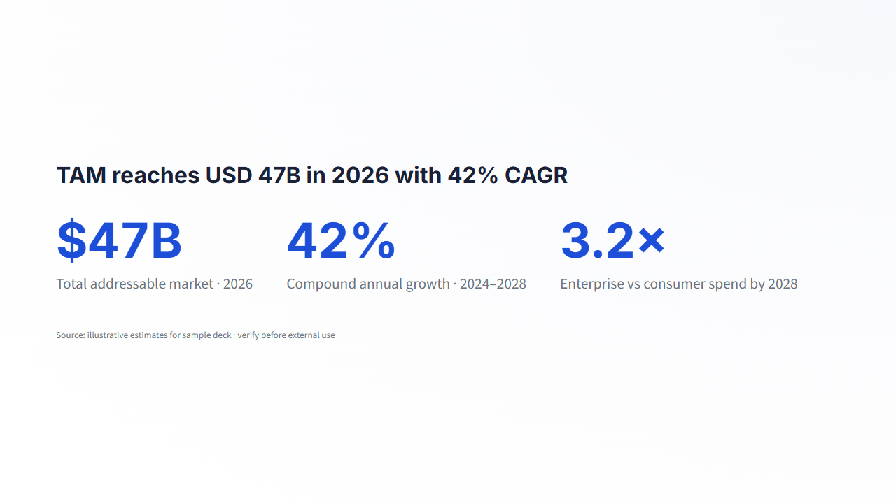
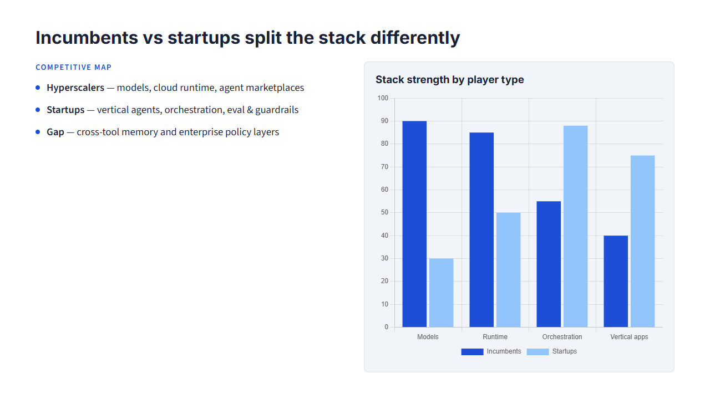
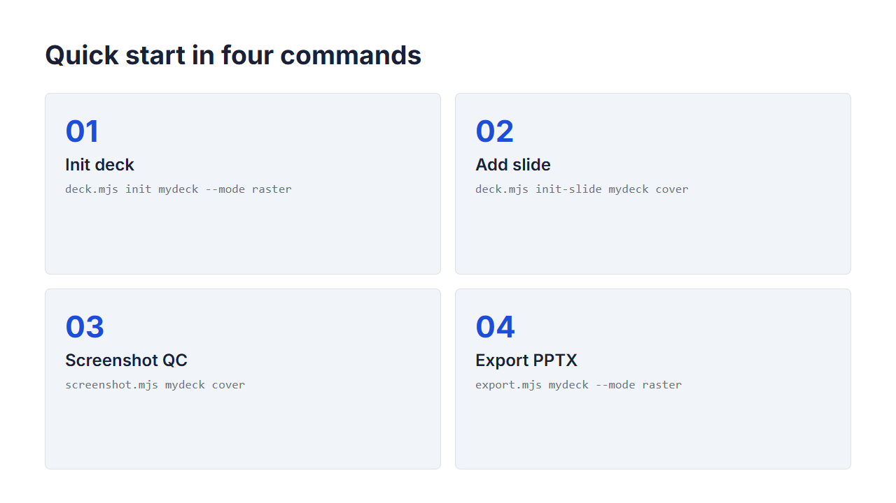

# PPTWork

PPTWork has two portable [Anthropic-style Skills](https://www.anthropic.com/news/skills)
for AI agents to plan, author, and export PowerPoint decks. Both work in
**OpenCode**, **Claude Code**, **Cursor**, **Codex**, or any other host that
honors the SKILL.md frontmatter convention.

## Skills shipped

| Skill | Trigger | What it does |
|---|---|---|
| [`ppt/`](ppt/SKILL.md) | "build a deck", "make a presentation", "export to PowerPoint" | End-to-end deck pipeline: clarify → plan → author → screenshot → export |
| [`ppt-html-authoring/`](ppt-html-authoring/SKILL.md) | "design a slide", "draft this page", "rewrite this layout" | Single-page authoring: writes `design.md` + a self-contained `slide.html` |

The two skills compose: the deck pipeline delegates each page to the
authoring skill. The authoring skill is also useful standalone when the
user just wants one slide.

## What's inside `ppt/scripts/`

The deck skill ships Node scripts that the agent calls via bash. They
replace what would otherwise be runtime tools, so the same skill works in
hosts that don't support custom MCP tooling.

| Script | Purpose |
|---|---|
| `deck.mjs` | Deck CRUD (`init` / `init-slide` / `move` / `delete` / `path` / `list`) |
| `screenshot.mjs` | Headless render of `slide.html` → `thumbnail.png` |
| `export.mjs` | PPTX export — default **editable** (`html2pptx-pro`), opt-in `--mode raster` |

### Tech stack

| Library | Role |
|---|---|
| **playwright-core** | Headless Chromium/Edge rendering of `slide.html`, screenshots |
| **html2pptx-pro** | Editable PPTX (HTML structure mapping) — default export engine |
| **dom-to-pptx** | DOM → slide elements — backup editable engine for diagnostics |
| **pptxgenjs** | PPTX file writing, raster export |

### Mental model: HTML is the source, PPTX is a build artifact

Every slide is just a self-contained HTML file. Authoring, revisions,
and layout fixes happen in the HTML. The export is one-way:

```
edit slide.html  →  screenshot.mjs to verify  →  export.mjs to ship .pptx
```

That's it. Don't try to edit the .pptx and round-trip changes back into
HTML — that path doesn't exist by design.

### Editable export (default)

`export.mjs <deck>` loads each `slide.html` in headless Chromium, injects
[`html2pptx-pro`](https://www.npmjs.com/package/html2pptx-pro), and maps the
live DOM into editable PowerPoint objects (text frames, lists, tables, shapes,
charts). This is the main path when the recipient needs to revise content
inside PowerPoint.

It is still an HTML-to-PPTX conversion — always open the result and verify
fonts, layout, and object ordering. If anything drifts, re-export with
`--mode raster` (pixel-faithful fallback) or, for one-slide diagnostics only,
`--editable-engine dom-to-pptx`.

Author editable decks with simple, explicit DOM structure; see
`ppt/references/editable-html-rules.md`.

### Raster export (high-fidelity fallback)

`export.mjs <deck> --mode raster` captures each slide as a single full-page
PNG (at deviceScaleFactor=2) and places it onto a 13.333×7.5 inch slide via
[`pptxgenjs`](https://github.com/gitbrent/PptxGenJS). Pixel-faithful to
the browser preview, immune to font substitution, robust against any
HTML / CSS quirks.

Text inside the .pptx isn't selectable — but that's the point: the
browser preview is the contract. To revise content, edit the slide.html
and re-run `export.mjs`.

## Setup

```bash
cd ppt
npm install                # or `bun install`
```

Dependencies: `playwright-core`, `html2pptx-pro`, `dom-to-pptx`, and
`pptxgenjs`. The headless renderer detects a local Chrome / Edge
automatically; if neither is installed, run `npx playwright install chromium`
once.

## Quick start

```bash
cd ppt
npm install

# kick off a deck in any project root
cd /path/to/your/project

node /path/to/skills/ppt/scripts/deck.mjs init pitch
node /path/to/skills/ppt/scripts/deck.mjs init-slide pitch cover
# ... write .pptwork/pitch/cover/slide.html (single-file, 1280x720) ...
node /path/to/skills/ppt/scripts/screenshot.mjs pitch cover
node /path/to/skills/ppt/scripts/export.mjs pitch
# → .pptwork/pitch/pitch.pptx
```

Run the smoke test to verify the toolchain end-to-end:

```bash
node ppt/test/smoke.mjs
```

It spins up a temporary project, walks the full pipeline, and reports
pass/fail per step.

### Try the sample decks

Two complete example decks ship in [`examples/`](examples/) with
`design.md`, `slide.html`, and pre-rendered `thumbnail.png` per slide.
Pre-built PPTX files are in [`examples/exports/`](examples/exports/).

**Why the shipped examples use raster export:** README preview images and
the committed `.pptx` files under `examples/exports/` were built with
`--mode raster` so GitHub / doc viewers show **pixel-identical** output to
the browser screenshots — useful for visual QA and README fidelity. This is
a packaging choice, not a platform limit: the **default export path is
editable** (`html2pptx-pro`), and the same example decks export to fully
editable PowerPoint when you omit `--mode raster` (editable copies are also
committed as `*-editable.pptx`).

| File | Mode | Text in PowerPoint |
|---|---|---|
| `examples/exports/pptwork-capabilities.pptx` | raster | not selectable (PNG slide) |
| `examples/exports/pptwork-capabilities-editable.pptx` | editable | selectable text frames |
| `examples/exports/ai-agent-landscape-2026.pptx` | raster | not selectable |
| `examples/exports/ai-agent-landscape-2026-editable.pptx` | editable | selectable text frames |

```bash
# Re-screenshot a sample slide (from repo root)
node ppt/scripts/screenshot.mjs examples/pptwork-capabilities/p01-cover

# Raster export — pixel-faithful (what README previews match)
node ppt/scripts/export.mjs pptwork-capabilities --mode raster \
  --output examples/exports/pptwork-capabilities.pptx

# Editable export — default engine; revise text/shapes inside PowerPoint
node ppt/scripts/export.mjs pptwork-capabilities \
  --output examples/exports/pptwork-capabilities-editable.pptx
```

Working copies for the export scripts live under `.pptwork/` at the repo root.

## Disk layout convention

Every deck lives at `.pptwork/<deck-name>/` in the project root:

```
.pptwork/
└── <deck-name>/
    ├── deck.json          # slide order — single source of truth
    ├── outline.md         # optional, story arc for long decks
    ├── materials/         # optional, research notes / digests
    │   ├── doc_raw.md
    │   └── research.md
    └── <slide-name>/
        ├── design.md      # frontmatter + Content / Note / Design sections
        ├── slide.html     # single-file, self-contained, 1280x720
        └── thumbnail.png  # produced by screenshot.mjs
```

`deck.json` is the **only** authoritative slide order. Don't hand-edit;
let `deck.mjs init-slide / move / delete` mutate it.

## Built-in template buckets

PPTWork ships **two starter buckets** (10 layouts total) under
`ppt/assets/`:

| Bucket | Theme | Layouts |
|---|---|---|
| [`corporate-light/`](ppt/assets/corporate-light/) | Crisp white, navy accent (Inter + Source Sans 3) | cover, agenda, two-column + chart, KPI row, closing CTA |
| [`claude-warm/`](ppt/assets/claude-warm/) | Warm cream, editorial pairing (Space Grotesk + Lora) | cover, section divider, timeline, quote, bento grid |

Each bucket follows this shape:

```
ppt/assets/<bucket>/
├── index.json                     # array of template descriptors
├── html/<id>.html                 # one self-contained reference slide per id
├── specs/<id>.json                # optional structured zone description
└── materials/<id>/                # optional images / svgs
```

The story-planning phase reads `index.json` to pick layouts; the
authoring phase reads the matching HTML to borrow composition.

Add your own buckets alongside the starters, or skip buckets entirely —
story planning can describe layouts in plain language and authoring
composes from scratch using `ppt-html-authoring/references/`.

Layout inspirations are documented in [`ATTRIBUTIONS.md`](ATTRIBUTIONS.md).

## Example showcase

Preview PNGs live in [`examples/showcase/`](examples/showcase/). Each slide
below is a real `thumbnail.png` from the sample decks (1280×720).

### Cover — claude-warm template + conclusion-form titles

From [`examples/pptwork-capabilities/p01-cover/`](examples/pptwork-capabilities/p01-cover/)



### Bento asymmetric grid — high-density architecture slides

From [`examples/pptwork-capabilities/p03-bento/`](examples/pptwork-capabilities/p03-bento/)



### flow-timeline — cross-page narrative / process arcs

From [`examples/pptwork-capabilities/p05-pipeline/`](examples/pptwork-capabilities/p05-pipeline/)



### kpi-stat-row — large-number metrics with source footnotes

From [`examples/ai-agent-landscape-2026/market-size/`](examples/ai-agent-landscape-2026/market-size/)



### two-column-insight — narrative + Chart.js side by side

From [`examples/ai-agent-landscape-2026/landscape/`](examples/ai-agent-landscape-2026/landscape/)



### Quick-start workflow — init → screenshot QC → export

From [`examples/pptwork-capabilities/p06-workflow/`](examples/pptwork-capabilities/p06-workflow/)



### Sample decks

- [`examples/pptwork-capabilities/`](examples/pptwork-capabilities/) — 8-page meta demo of the skill pipeline
- [`examples/ai-agent-landscape-2026/`](examples/ai-agent-landscape-2026/) — 7-page content pitch alternating both themes

## License

MIT — see [`LICENSE`](LICENSE).

## Acknowledgements

Filesystem-as-database deck contract and the export toolchain (headless
render via playwright-core, editable conversion via html2pptx-pro /
dom-to-pptx, raster assembly via pptxgenjs) are adapted from a closed-source
OpenCode plugin. Released here in skill form so the same workflow runs on
any agent host.

Built-in layout templates adapt MIT-licensed design patterns from
[presentation-skill-pack](https://github.com/isatimur/presentation-skill-pack)
and [ppt-agent-skill](https://github.com/Akxan/ppt-agent-skill) — see
[`ATTRIBUTIONS.md`](ATTRIBUTIONS.md) for details.
